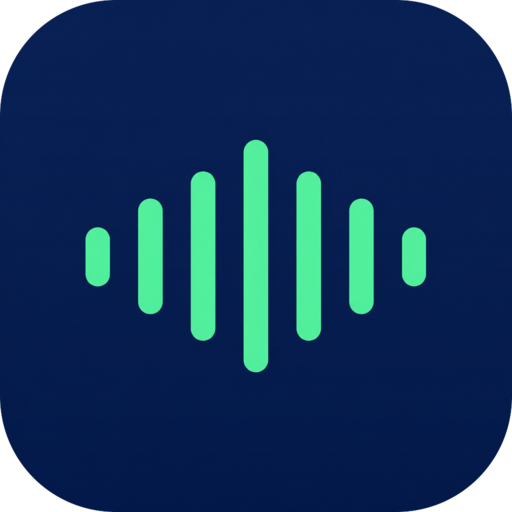

<div align="center">
  

  # ChannelPulse OSS

  **A private, local‑first AI interview copilot.** A translucent, always‑on‑top floating window that takes notes and coaches you during interviews, technical screens, and meetings — powered entirely by **your own LLM** and **on‑device speech‑to‑text**. No cloud required. No account. No telemetry.

  [](https://tauri.app/)
  [](https://reactjs.org/)
  [](LICENSE)

  [Website](https://channelpulse.us) · [Get the hosted app](https://channelpulse.us/download) · [Pricing](https://channelpulse.us/pricing)
</div>

---

ChannelPulse OSS is the free, open‑source, **privacy‑first** edition of [ChannelPulse](https://channelpulse.us). It runs **natively** — a real desktop app for **macOS, Windows, and Linux**, built with Rust + Tauri, not a browser tab or an Electron wrapper — that listens to your calls, transcribes them **natively on‑device**, and gives you clear, speakable notes and talking points on a floating window — plus **self‑guided practice interviews** with AI scoring.

Everything runs on your machine:

- 🧠 **Bring your own LLM** — point it at **Ollama** (fully offline), **Kimi / Moonshot**, OpenAI, Anthropic, OpenRouter, or **any provider** via a simple cURL template. Your keys are entered in Settings and stored **locally on your device**.
- 🎙️ **On‑device speech‑to‑text** — transcription runs with **whisper.cpp**, compiled right into the app. Download a model once and it works offline forever. Already paying for a transcription API? You can point it at **OpenAI Whisper, Groq, Google, Deepgram or AssemblyAI** with your own key instead — off by default, and clearly labelled, because that sends your audio to them.
- 🔒 **Zero telemetry** — no analytics, no tracking, no phone‑home. The build **fails** if an API key is ever baked into the client bundle.
- 💾 **Local‑first storage** — your chats, files, and personas live in a local SQLite database on your machine.

> **ChannelPulse OSS vs. the hosted app:** this repo is the do‑it‑yourself, own‑your‑data edition. If you'd rather **sign in and go** — managed AI with no keys to configure, low‑latency streaming transcription with speaker diarization, cloud sync & backup across devices, the full guided tutorials library, and a prep bank of **thousands of real interview questions across hundreds of companies** so you walk in already confident — check out the hosted app at **[channelpulse.us](https://channelpulse.us)**.

---

## OSS vs. hosted

| | **ChannelPulse OSS** (this repo) | **ChannelPulse** ([hosted](https://channelpulse.us)) |
| --- | --- | --- |
| **AI / LLM** | Bring your own — Ollama, Kimi, OpenAI, Anthropic, OpenRouter, any API | Managed, **no keys to configure** |
| **Speech‑to‑text** | **On‑device** whisper.cpp (you supply a model), or your own cloud key | Managed real‑time streaming + speaker diarization |
| **Text‑to‑speech** | Offline, your OS's built‑in voice | Natural cloud voices |
| **Data & storage** | 100% local, on your machine | Local‑first, **synced & backed up** to your account |
| **Telemetry** | **None** | Product analytics |
| **Cost** | **Free**, forever | Free plan + Pro subscription |
| **Setup** | Install, add your key, drop in a model | Sign in and go |
| **Updates** | Download new releases from GitHub | Automatic in‑app updates |
| **Guided tutorials** | Not in this edition | Included |
| **Support** | Community | Priority |

👉 **Want the zero‑setup experience?** [Download the hosted app](https://channelpulse.us/download) or [see pricing](https://channelpulse.us/pricing).

---

## Walk in already prepared

Real-time help in the room is only half the battle — the interviews you win are the ones you walk into **already confident**. The hosted app opens the full **guided tutorials** library and a prep bank of **thousands of real interview questions across hundreds of companies**, organized by role, round, and difficulty, so you can rehearse the exact interview you're about to sit — behavioral, coding, and system design — with AI scoring, model answers, and progressive hints until it's second nature.

- 📚 **Company-specific prep** — thousands of verified questions mapped to the companies and roles people actually interview for.
- 🎓 **Guided tutorials** — structured, self-paced courses that take you from "winging it" to walking in prepared.
- 📈 **Practice until confident** — score every answer, reveal the model answer, and track your progress across sessions.

That's the fast lane: [**create a free account**](https://channelpulse.us) and start prepping in minutes — no setup, no keys, nothing to install.

> **Prefer to keep everything on your own machine?** That's exactly what this open-source edition is for. Your transcripts, notes, practice, and prep **never leave your device** — no cloud, no account, no telemetry — while you still get real-time coaching, powered by your own LLM and on-device speech-to-text. **Total privacy, fully local.**

---

# Features

## Interview Practice

Run **self‑guided mock interviews** on your own. The AI plays the interviewer, asks natural follow‑ups, and **scores each answer** with feedback and a **model answer**. Every session is saved so you can review and improve.

- **Company question bank** — verified questions across top companies, organized by category (technical, behavioral, coding, system design) and difficulty.
- **Coding workbench** — write and **run** JavaScript in a sandbox, then **submit for an AI pass/fail**. Feedback, errors, and **progressive hints** are written right into your editable code, with a step‑by‑step reveal of the full solution.
- **System‑design whiteboard** — sketch your architecture on a canvas and submit the diagram for AI grading. Get **diagram‑aware hints**, reveal a model design, and **save your diagram as a PNG**.
- **Read‑aloud questions** — questions are spoken with your OS voice and a follow‑along word highlight.

## Floating overlay & live notes

A minimal floating bar is the launcher: start/stop listening, screen capture, settings, and a drag handle. While listening it shows a live audio **waveform** and expands into a panel with the transcript, AI response, follow‑up chat, and tools. Answers can include **web research with citations** (bring your own Firecrawl key) and **Mermaid diagrams**.

## System audio + microphone capture

Listen to **system audio** (a meeting, a video, anything through your speakers) and, optionally, your **microphone** at the same time. Speaker labels — *You* vs *Them* — come from the capture source, so attribution works without sending your audio anywhere.

- **Auto‑detect** mode (transcribes on natural pauses) or **Manual** mode (press to record), with a mic toggle and a live audio visualizer.
- **Shortcut:** `Cmd+Shift+M` (macOS) / `Ctrl+Shift+M` (Windows)

## Screenshots & image attachments

Capture screenshots (full screen or click‑and‑drag) and attach image files for visual analysis by any vision‑capable model you configure.

- **Shortcut:** `Cmd+Shift+S` (macOS) / `Ctrl+Shift+S` (Windows)

## Dashboard & workspace

Open the dashboard with `Cmd+Shift+D` / `Ctrl+Shift+D`: full **chat history** with search, **Files** to ground answers on your résumé/docs, **Personas** (scenario‑based system prompts), and a durable **Profile** so answers stay about you.

---

# Quickstart

## 1. Prerequisites

Install the platform dependencies for Tauri:

👉 **[Tauri Prerequisites & Dependencies](https://v2.tauri.app/start/prerequisites/)**

You'll also need **Node.js** (v18+), **Rust** (latest stable), **npm**, and a C/C++ toolchain with **CMake** (whisper.cpp is compiled from source).

On **macOS**, building the system‑audio module requires **full Xcode** (not just the Command Line Tools), and the Core Audio process tap used for system‑audio capture requires **macOS 14.2+**.

## 2. Install & run

```bash
git clone https://github.com/willysharp5/ChannelPulse-oss.git
cd ChannelPulse-oss
npm install

# macOS: point the build at full Xcode so the audio module compiles
DEVELOPER_DIR=/Applications/Xcode.app/Contents/Developer npm run tauri dev

# Windows / Linux
npm run tauri dev
```

No environment configuration is required — the app runs fully local out of the box, and nothing in it is gated behind an account. (See [Optional: your own backend](#optional-your-own-backend) if you want cross‑device sync.)

## 3. Add your LLM (in Settings)

Open **Settings → AI Provider** and choose a provider:

- **Ollama** — fully offline. Run a model locally (e.g. `ollama run llama3.1`) and point ChannelPulse at `http://localhost:11434`.
- **Kimi / Moonshot, OpenAI, Anthropic, OpenRouter, …** — paste your API key. It's stored **locally on your device** and never leaves it except to call the provider you chose.
- **Anything else** — add a custom provider as a cURL template with `{{API_KEY}}`, `{{MODEL}}`, `{{SYSTEM_PROMPT}}`, and `{{TEXT}}` placeholders.

## 4. Add a speech‑to‑text model

Transcription runs on‑device with whisper.cpp. You supply a model **once**:

1. Download a whisper **GGML** model — start with **`ggml-base.en.bin`** (~148 MB, English) from **[huggingface.co/ggerganov/whisper.cpp](https://huggingface.co/ggerganov/whisper.cpp/tree/main)**. Larger models (`small`, `medium`, `large-v3`) are more accurate but slower; `tiny`/`base` are fastest.
2. In the app, open **Settings → Speech‑to‑Text** and click **Open models folder**.
3. Drop the `.bin` file into that folder. That's it — transcription now works fully offline.

Prefer a custom location? Set the `CHANNELPULSE_WHISPER_MODEL` environment variable to the absolute path of your `.bin` file.

### Or use a transcription API instead

If you'd rather not manage a model file, **Settings → Speech‑to‑Text → Engine** also accepts your own cloud account:

| Engine | What you enter |
| --- | --- |
| **OpenAI‑compatible** | An API key, plus (optionally) a base URL and model — so OpenAI, **Groq**, or any local server implementing `POST /audio/transcriptions` all work |
| **Google Cloud Speech‑to‑Text** | An API key for a project with the Speech‑to‑Text API enabled |
| **Deepgram** | An API key (this is the only engine here that labels who spoke) |
| **AssemblyAI** | An API key (upload‑then‑poll, so a few seconds slower per clip) |

Keys are stored on that device only and are never synced. This is opt‑in and off by default: picking a cloud engine means your call audio is sent to that provider, and their privacy policy applies to it. `whisper.cpp` remains the default and the only fully offline option.

## Build for production

```bash
# macOS
DEVELOPER_DIR=/Applications/Xcode.app/Contents/Developer npm run tauri build

# Windows / Linux
npm run tauri build
```

Installers land in `src-tauri/target/release/bundle/` (`.dmg` on macOS; `.msi`/`.exe` on Windows; `.deb`/`.AppImage` on Linux). Builds are **unsigned** — your OS may ask you to allow the app on first launch.

## Permissions (macOS)

Grant these to ChannelPulse OSS in **System Settings**:

- **Screen & System Audio Recording** — to capture system audio.
- **Microphone** — for voice input.
- **Screen Recording** — for screenshots.

---

## Optional: your own backend

Nothing in this edition is gated behind an account — sign-in exists only for people who want to run their **own** Supabase project, which turns on cross‑device sync and the company question bank. Leave it unconfigured (the default) and the app runs in fully offline, no‑account mode.

To point it at a project you control, copy `.env.example` to `.env.local` and fill in the Supabase values:

```bash
VITE_SUPABASE_URL=
VITE_SUPABASE_ANON_KEY=
```

> **Never** put an LLM or speech provider API key in a `VITE_*` variable — those are inlined into the client bundle. Provider keys are entered at runtime in Settings and stored locally. The build intentionally fails if it detects a secret‑shaped `VITE_*` variable.

---

## Alternatives & related projects

ChannelPulse OSS is part of a growing family of **AI interview / meeting copilots** and "AI notetaker" desktop apps. If you're comparing options, here are other projects in the space. Our angle is deliberately different: **fully local, bring‑your‑own‑LLM, on‑device speech‑to‑text, no telemetry, AGPL** — and geared toward **honest prep and live coaching**, not "beating" an interview undetected.

**Open‑source alternatives**

| Project | Repo | Notes |
| --- | --- | --- |
| **Pluely** | [`iamsrikanthnani/pluely`](https://github.com/iamsrikanthnani/pluely) | Privacy‑focused Tauri meeting/interview assistant; an open‑source Cluely alternative (GPL‑3.0). |
| **Natively** | [`Natively-AI-assistant/natively-cluely-ai-assistant`](https://github.com/Natively-AI-assistant/natively-cluely-ai-assistant) | Meeting assistant + interview copilot with real‑time transcription and local RAG. |
| **cheating‑daddy** | [`sohzm/cheating-daddy`](https://github.com/sohzm/cheating-daddy) | Electron overlay giving real‑time AI help from screen + audio capture (GPL‑3.0). |
| **Glass** | [`pickle-com/glass`](https://github.com/pickle-com/glass) | "Invisible" desktop assistant that watches the screen and listens (GPL‑3.0). |
| **free‑cluely** | [`Prat011/free-cluely`](https://github.com/Prat011/free-cluely) | Open Cluely‑style assistant for meetings and interviews (Apache‑2.0). |
| **OpenCluely** | [`TechyCSR/OpenCluely`](https://github.com/TechyCSR/OpenCluely) | Overlay for technical‑interview help (DSA / online assessments) (Apache‑2.0). |
| **Interview Coder** | [`ibttf/interview-coder`](https://github.com/ibttf/interview-coder) | Desktop app focused on coding interviews; source behind the commercial interviewcoder.co. |

**Paid / commercial alternatives**

- **[Cluely](https://cluely.com)** — real‑time meeting assistant with live answers, hidden from screen share.
- **[Final Round AI](https://www.finalroundai.com)** — Interview Copilot with real‑time answers and prep tools.
- **[LockedIn AI](https://www.lockedinai.com)** — interview + meeting copilot with live answers and coding help.
- **[Sensei AI](https://www.senseicopilot.com)** — real‑time interview copilot with structured (STAR) answers.
- **[Verve AI](https://www.vervecopilot.com)** — interview copilot for behavioral, coding, and online assessments.
- **[interviewing.io](https://interviewing.io)** — a different category: anonymous **mock interviews** with real engineers, plus a free AI interviewer for practice.

> Licenses and pricing above can change — check each project's repo (`LICENSE`) or pricing page before relying on the details. Listing a project here is not an endorsement; many of these market "undetectable/invisible" modes, and we'd encourage using any interview tool ethically — for genuine practice, preparation, and accessibility.

---

## Contributing

Issues and pull requests are welcome. This is a community edition — please keep it privacy‑first: no telemetry, no baked‑in secrets, and no code paths that send user data to a hosted backend by default.

## Support

- **Hosted app & website:** https://channelpulse.us
- **Bugs & ideas:** [open an issue](https://github.com/willysharp5/ChannelPulse-oss/issues)

## License

ChannelPulse OSS is licensed under the **GNU Affero General Public License v3.0** (AGPL‑3.0). See [LICENSE](LICENSE). If you run a modified version as a network service, the AGPL requires you to make your source available to its users.
